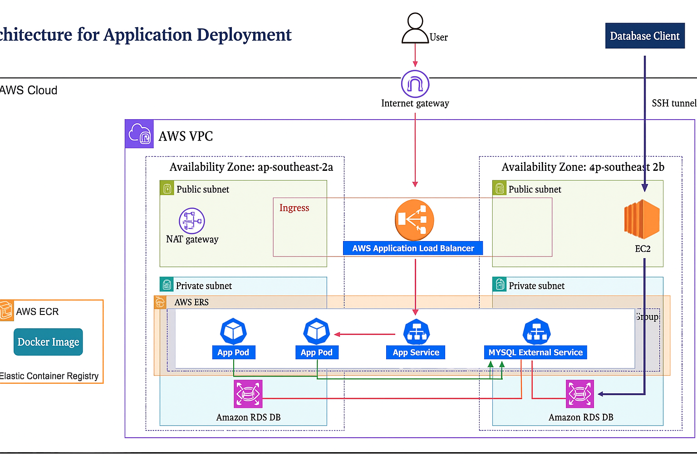

# 1️⃣ Fix README.md conflict — keep your detailed README, overwrite the file
cat > README.md <<'EOF'
# Meo Stationery 📝✏️

A modern e-commerce platform for stationery products built with Next.js, Prisma, and PostgreSQL, designed for AWS cloud deployment.



## 🏗️ Architecture Overview

This application follows a cloud-native architecture with:

- **Frontend**: Next.js 15 with Tailwind CSS and Radix UI
- **Backend**: Next.js API routes with Prisma ORM
- **Database**: PostgreSQL (Local development + AWS RDS for production)
- **Container**: Docker with multi-stage builds
- **Orchestration**: Kubernetes (EKS) with auto-scaling
- **Infrastructure**: AWS with Terraform (VPC, ALB, RDS, ECR)

## ✨ Features

- 🛍️ Product catalog with categories (A-P) and search functionality
- 🛒 Shopping cart with real-time updates
- 📦 Order management system with status tracking
- 👤 User authentication and profile management
- 💳 Payment integration with VNPay gateway
- 📱 Fully responsive design with Tailwind CSS
- 🎨 Modern UI components with Radix UI
- 🐳 Docker containerization ready
- ☸️ Kubernetes deployment configuration
- 🌩️ AWS cloud infrastructure with Terraform

## 🚀 Quick Setup

### Option 1: Docker Setup (Recommended)

```bash
# Start with Docker Compose (includes PostgreSQL)
docker compose up -d

# View logs
docker compose logs -f

# Access the application
open http://localhost:3000

# Stop containers
docker compose down
